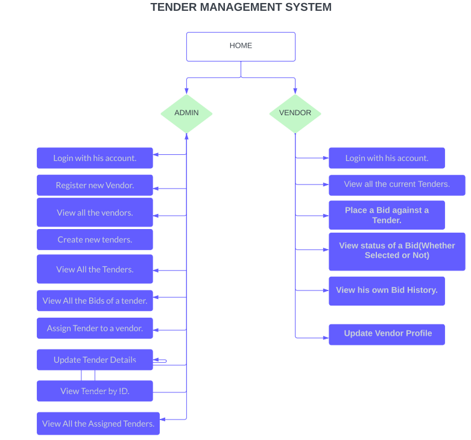
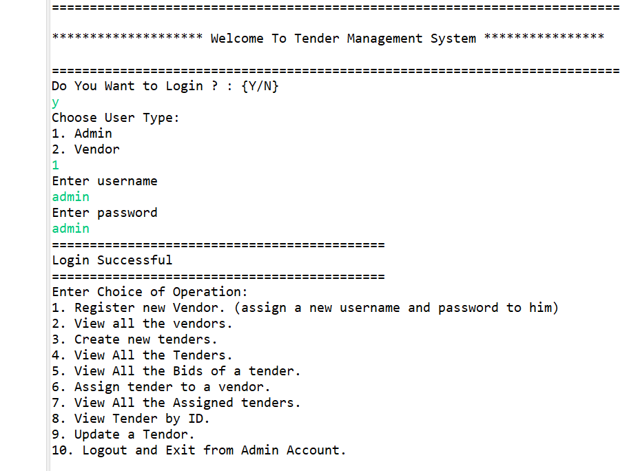
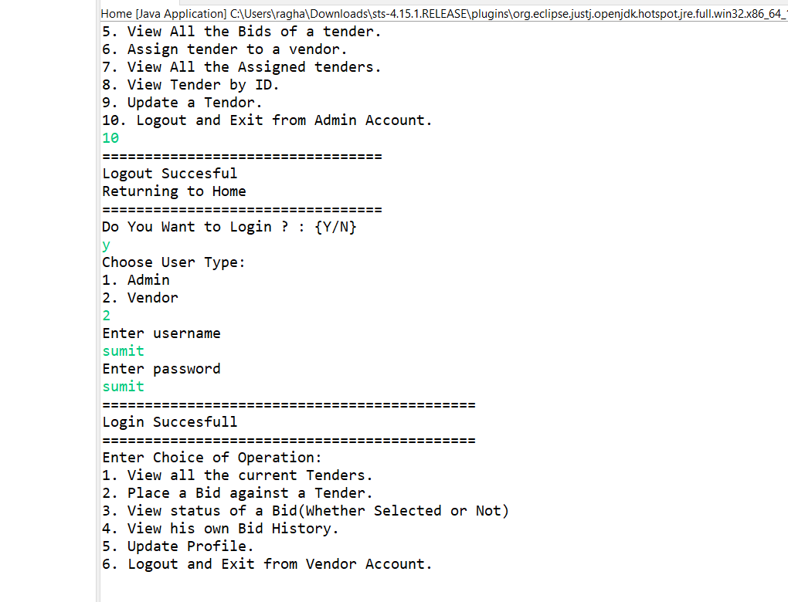

<h1 align="center">Tender Management System</h1>
<h3 align="center">Whenever a company requires a service / merchandise , a tender is floated. Company maintains an empaneled list of Vendors. An empaneled vendor can only bid for a tender. Every vendor can bid only once against each tender. Against each tender there may be bids from several vendors. The company will then select the most suitable bid and places the order to that vendor.</h3>
 

<h2 align="left">There are 2 users in the system</h2>
<h4 align="left">1. Administrator and</h4>
<h4 align="left">2. Vendor</h4>
 

<h2 align="left">The Role of Administrator is: </h2>
<h4 align="left">1. Login with his account.</h4>
<h4 align="left">2. Register new Vendor. (assign a new username and password to him)</h4>
<h4 align="left">3. View all the vendors.</h4>
<h4 align="left">4. Create new tenders.</h4>
<h4 align="left">5. View All the Tenders.</h4>
<h4 align="left">6. View All the Bids of a tender.</h4>
<h4 align="left">7. Assign Tender to a vendor.</h4>
<h4 align="left">8. Update Tendor Details</h4>
<h4 align="left">9. View All the Assigned Tenders.</h4>
<h4 align="left">10. View Tender by ID.</h4>
 

<h2 align="left">The Role of a Vendor is: </h2>
<h4 align="left">1. Login with his account (username and password given by admin)</h4>
<h4 align="left">2. View all the current Tenders.</h4>
<h4 align="left">3. Place a Bid against a Tender.</h4>
<h4 align="left">4. View status of a Bid(Whether Selected or Not)</h4>
<h4 align="left">5. View his own Bid History.</h4>
<h4 align="left">6. Update Vendor Profile</h4>
 

<h2 align="left">Technologies used: Back-End Development</h2>
<h4 align="left">Java</h4>
<h4 align="left">JDBC</h4>
<h4 align="left">MySQL</h4>
 

<h2 align="left">==== Software And Tools Required ======</h2>
<h4 align="left">MySQL.</h4>
<h4 align="left">Spring Tools</h4>
<h4 align="left">Java JDK 8+</h4>

<h1 align="center">Acknowledgements</h1>

- [Live Project Link]()

## Authors

- [@sumitraghavwork](https://github.com/sumitraghavwork)

<h1 align="center">App Screenshot</h1>

  

  

  

## Appendix

Any additional information goes here
